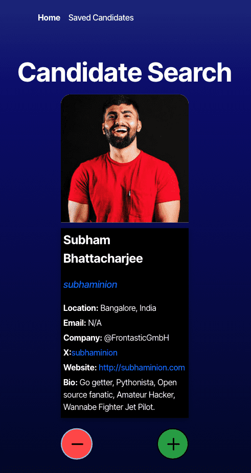
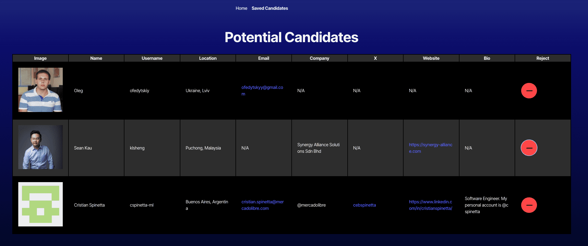

# Candidate Search

## Description

The Candidate Search app is a React application that allows users to search for GitHub users and view their profiles. The app fetches user data from the GitHub API and displays it in a card format. Users can save candidates they are interested in or skip to the next candidate.

## Table of Contents

-   [Usage](#usage)
-   [Contributing](#contributing)
-   [Questions](#questions)
-   [Credits](#credits)
-   [Preview](#preview)

## Usage

To use this application, simply goto [https://candidate-search-3kl4.onrender.com](https://candidate-search-3kl4.onrender.com)

## Contributing

Contributions are welcome. Please submit a pull request or open an issue for any feature requests or bugs.

## Questions

For any questions, please contact me at jace.galloway@gmail.com. You can also find my GitHub profile at [JaceG](https://github.com/JaceG).

## Credits

Credits: This project was created as part of a coding bootcamp challenge. - Sources and References: Portions of the code and guidance were provided with assistance from ChatGPT & a Tutor.

## Preview

